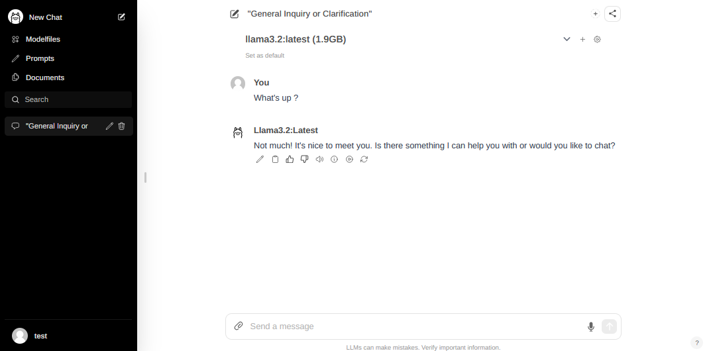
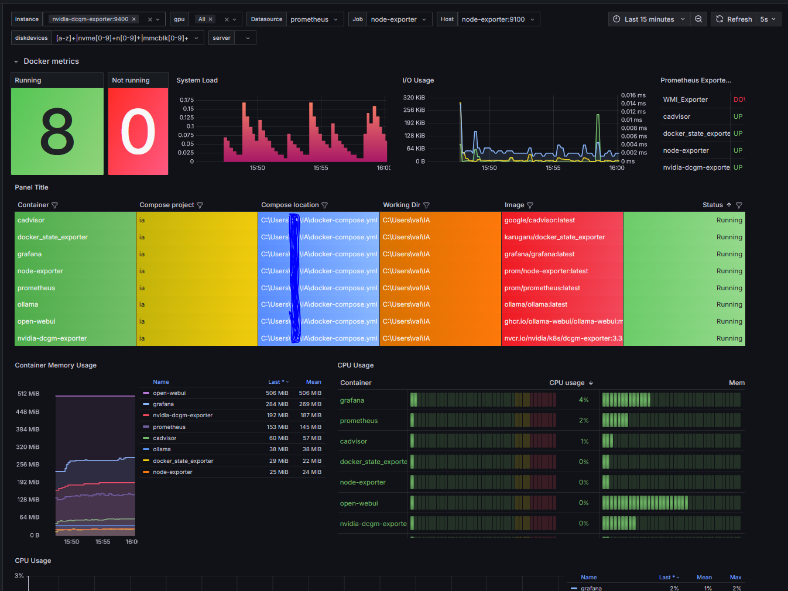

# Docker Stack with Ollama and Open Web UI + grafana Monitoring

This project provides a Docker-based monitoring and application stack for the Ollama service, Grafana dashboards, and various monitoring tools.






## Project Structure

Directory structure that separates configuration files, Docker assets, and Grafana dashboards :

```plaintext
docker-monitoring-ollama/
├── .gitignore
├── README.md
├── grafana/
│   ├── grafana.ini
│   └── dashboards/
│       └── bench_metrics.json  # dashboard JSON
├── prometheus/
│   └── prometheus.yml # Prometheus configuration
 service
```

## Services

- **ollama**: Core application container for the Ollama service, using NVIDIA GPUs.
- **open-webui**: Web interface for interacting with Ollama.
- **prometheus**: Metrics collection system for monitoring Docker containers and applications.
- **grafana**: Visualization and dashboard service.
- **node-exporter**: Exposes system-level metrics for Prometheus.
- **cadvisor**: Provides insights into container resource usage.
- **docker_state_exporter**: Monitors Docker states.
- **nvidia-dcgm-exporter**: Exports NVIDIA GPU metrics.

## Getting Started

1. Clone the repository.
   ```bash
   git clone https://github.com/your-username/docker-monitoring-ollama.git
   cd docker-monitoring-ollama
   ```

2. Start the stack with Docker Compose.
   ```bash
    docker-compose up -d
    ```

3. Access the services:
- **Ollama**: http://localhost:11434
- **Open Web UI**: http://localhost:3000
- **Prometheus**: http://localhost:9090
- **Grafana**: http://localhost:3001

## Configuration
- **Grafana Dashboards**: Add your dashboards to grafana/dashboards/ or import it via grafana webui.
- **Prometheus**: Customize the prometheus/prometheus.yml file as needed.
- **Image generation**: To activate image generation, set ENABLE_IMAGE_GENERATION=True in webui docker compose and follow this project guide : https://github.com/AUTOMATIC1111/stable-diffusion-webui